<h2>
  <code>munazimbhat@github:~$ ./profile.sh</code>
</h2>

  <code>Penetration Tester</code> •
  <code>Web Application Security</code> •
  <code>Bug Bounty</code>

 

  

<h3>
  <code>munazimbhat@github:~$ whoami</code>
</h3>

<table>
  <tr>
    <td valign="top">
      
    </td>

    <td valign="top">
      
    </td>
  </tr>
</table>

 

<h3>
  <code>munazimbhat@github:~$ skills</code>
</h3>

  <code>Burp Suite</code> •
  <code>Kali Linux</code> •
  <code>Nmap</code> •
  <code>OWASP Top 10</code> •
  <code>Linux</code> •
  <code>Bash</code> •
  <code>Web Security</code> •
  <code>Vulnerability Assessment</code> •
  <code>Penetration Testing</code>

 

<h3>
  <code>munazimbhat@github:~$ status</code>
</h3>

<pre>
[+] Learning
[+] Building
[+] Breaking
[+] Securing
[+] Hunting vulnerabilities
</pre>

 

  <code>echo "Think like an attacker. Build like a defender."</code>

